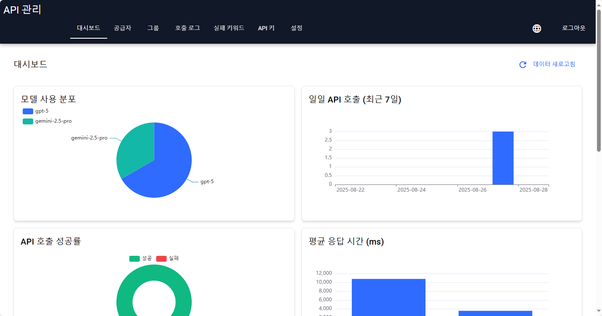
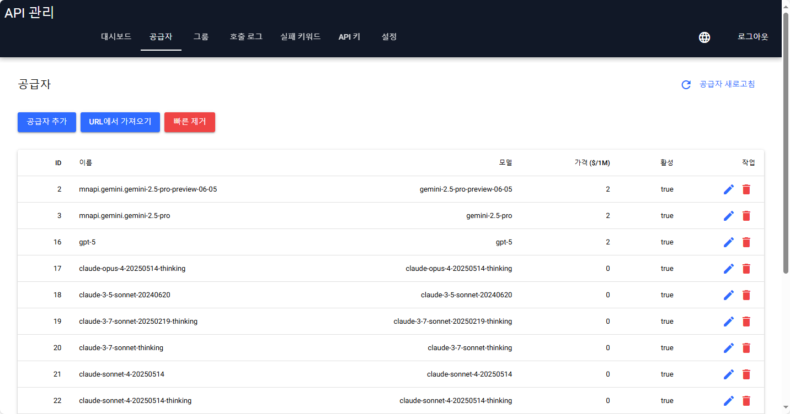
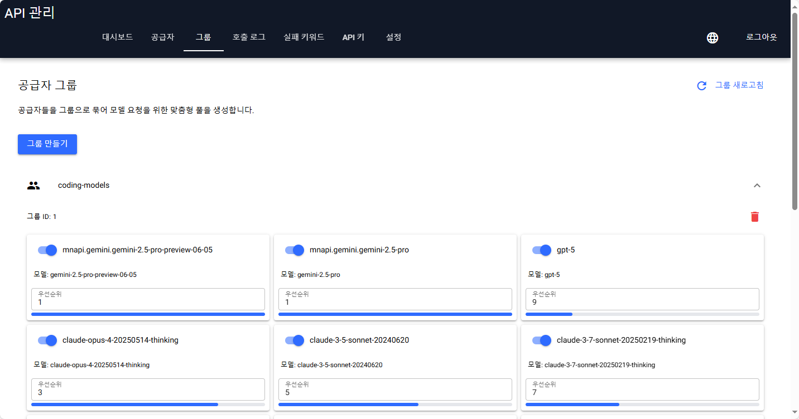
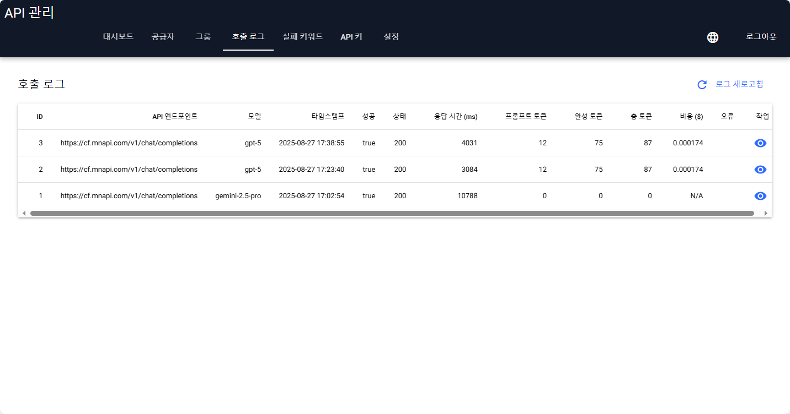
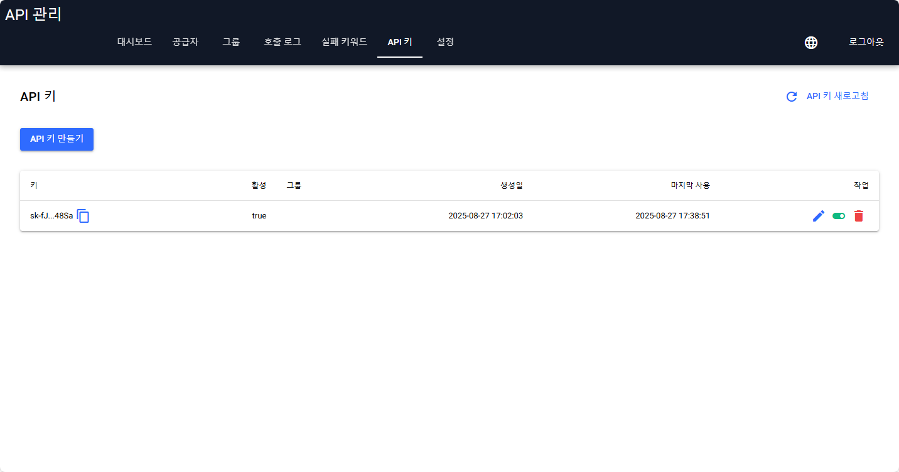
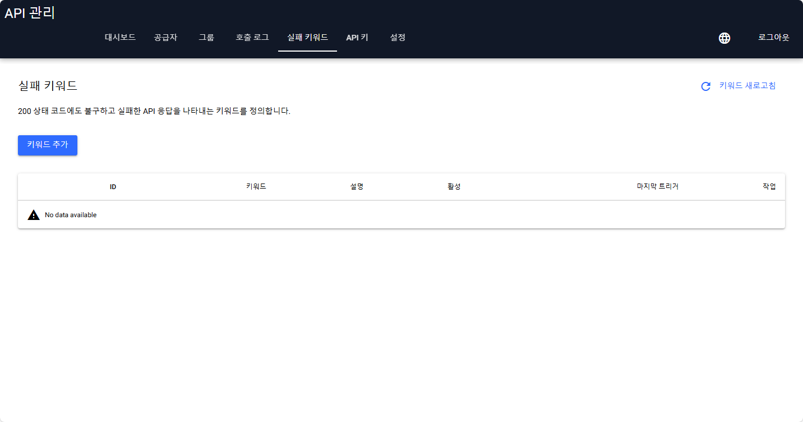
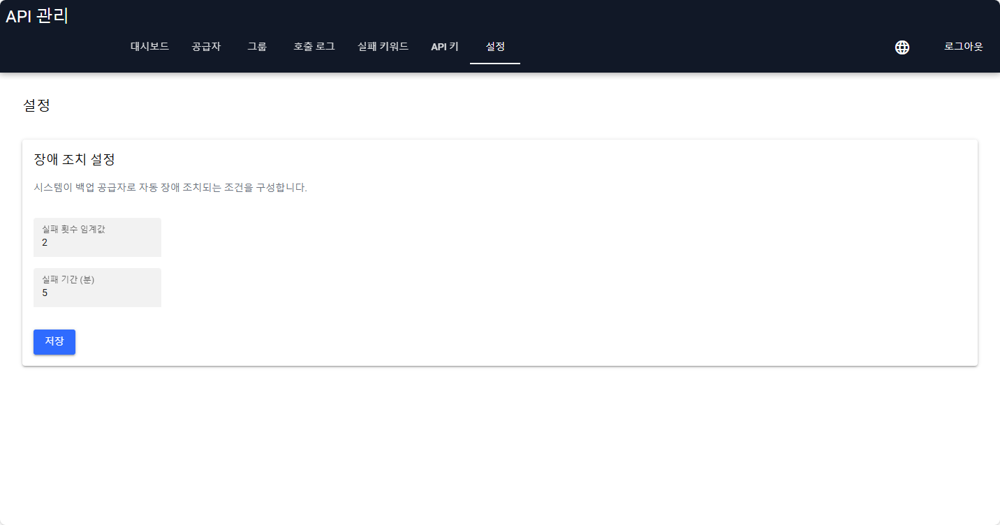

[English](README.md) | [中文](README_ZH.md) | [한국어](README_KO.md) | [日本語](README_JA.md)

---
# AI Provider API 서버

선도적인 오픈 소스 프록시 솔루션에서 영감을 받아 다양한 AI 제공업체에 대한 요청을 관리하고 라우팅하는 지능형 API 서버입니다. 이 서버는 다양한 다운스트림 AI 모델 및 서비스를 위한 통합된 OpenAI 호환 API 엔드포인트를 제공합니다. 핵심 강점은 강력하고 유연한 API 라우팅 및 필터링 기능에 있습니다.

## ✨ 핵심 기능: 지능형 API 라우팅

이 서버의 주요 기능은 애플리케이션과 다양한 AI 모델 제공업체 간의 스마트 중개자 역할을 하는 것입니다. 제공업체 엔드포인트 풀을 정의하고 그룹화하여 서버가 규칙 집합에 따라 각 수신 요청에 가장 적합한 엔드포인트를 동적으로 선택하도록 할 수 있습니다.

### 작동 방식

1.  **제공업체(Providers)**: 먼저 개별 AI 제공업체 엔드포인트를 등록합니다. 각 제공업체는 고유한 API 키, 엔드포인트 URL 및 비용 정보(예: 백만 토큰당 가격)를 가집니다.

2.  **그룹(Groups)**: 그런 다음 "그룹"을 만들고 여기에 제공업체를 추가합니다. 그룹은 가상 통합 모델 엔드포인트 역할을 합니다. 예를 들어, 여러 제공업체에서 GPT-4 클래스 모델을 제공하는 엔드포인트를 포함하는 `gpt-4-pool`이라는 그룹을 만들 수 있습니다.

3.  **우선순위 기반 라우팅(Priority-Based Routing)**: 그룹 내에서 각 제공업체에 `priority` 번호를 할당합니다. 해당 그룹에 대한 요청이 들어오면 서버는 가장 낮은 우선순위 번호(예: 우선순위 `1`)를 가진 제공업체를 먼저 사용하려고 시도합니다.

4.  **자동 장애 조치(Automatic Failover)**: 가장 높은 우선순위의 제공업체가 실패하면(예: API 오류, 네트워크 문제 또는 속도 제한으로 인해) 서버는 우선순위 목록의 다음 제공업체로 요청을 자동으로 원활하게 재시도합니다. 이 과정은 요청이 성공하거나 그룹의 모든 제공업체를 시도할 때까지 계속됩니다.

5.  **API 호출**: 애플리케이션은 표준 OpenAI 호환 API를 호출하지만, `model` 매개변수에 `gpt-4-turbo`와 같은 모델 이름을 지정하는 대신 **그룹 이름**(예: `gpt-4-pool`)을 지정합니다.

이 아키텍처는 고가용성, 비용 최적화(저렴한 제공업체 우선 사용)를 제공하고 클라이언트 측 로직을 크게 단순화합니다.

## 💎 추가 기능

*   **OpenAI 호환성**: `/v1/chat/completions` 및 `/v1/models` 엔드포인트를 지원하여 기존 도구 및 라이브러리와 원활하게 통합됩니다.
*   **고급 API 키 관리**: API 키를 생성하고 특정 그룹에 할당하여 모델 액세스를 세밀하게 제어합니다.
*   **모델 가져오기 도구**: 모든 OpenAI 호환 제공업체에서 모델을 신속하게 가져옵니다. 쉬운 구성을 위해 별칭, 필터링 및 키워드 제외를 지원합니다.
*   **스트리밍 지원**: 실시간 챗봇 경험을 위해 스트리밍 응답을 완벽하게 지원합니다.
*   **구성 가능한 장애 조치**: 웹 UI를 통해 장애 조치 로직을 미세 조정하고 재시도에 대한 임계값과 시간 창을 설정합니다.

## 🖥️ 시각적 관리 대시보드

이 애플리케이션에는 [NiceGUI](https://nicegui.io/)로 구축된 현대적이고 기능이 풍부한 관리 대시보드가 포함되어 있습니다.

*   **대화형 대시보드**: 모델 분포, 일일 트래픽, 성공률 및 평균 응답 시간을 포함한 여러 차트로 API 사용량을 시각화합니다.
*   **다국어 지원**: 인터페이스는 영어, 중국어, 일본어 및 한국어를 포함한 여러 언어로 제공됩니다.
*   **제공업체 및 그룹 관리**: 직관적인 인터페이스에서 AI 모델 제공업체를 추가, 편집 및 그룹화합니다.
*   **상세 호출 로그**: HTTP 상태, 응답 시간, 토큰 사용량 및 비용을 포함하여 모든 API 요청에 대한 상세 로그를 검사합니다.
*   **실패 키워드**: 제공업체의 응답에서 발견될 경우 자동 재시도를 트리거하는 키워드를 정의합니다.

## 🖼️ 기능 갤러리

| 대시보드 | 공급자 | 그룹 |
| :---: | :---: | :---: |
|  |  |  |
| 실시간 API 사용량, 성공률 및 성능 지표를 한눈에 모니터링합니다. | 자격 증명, 비용 및 강력한 모델 가져오기 도구를 포함하여 모든 AI 공급자 엔드포인트를 관리합니다. | 여러 공급자를 함께 그룹화하여 우선순위 기반 장애 조치 기능이 있는 가상 엔드포인트를 만듭니다. |

| 호출 로그 | API 키 | 실패 키워드 |
| :---: | :---: | :---: |
|  |  |  |
| 모든 API 호출에 대한 자세한 로그를 검사합니다. 로그를 클릭하면 전체 응답 내용과 비용 세부 정보를 볼 수 있습니다. | 세분화된 액세스 제어를 위해 API 키를 생성하고 특정 그룹에 할당합니다. | 공급자의 응답에서 발견될 경우 자동 장애 조치를 트리거하는 키워드를 정의합니다. |

| 설정 |
| :---: |
|  |
| UI 언어 및 장애 조치 재시도 로직과 같은 전역 설정을 구성합니다. |

##  시작하기

다음 지침에 따라 로컬 컴퓨터에서 API 서버를 시작하고 실행하십시오.

### 전제 조건

*   Python 3.8+
*   Uvicorn과 같은 ASGI 서버

### 설치

1.  **저장소 복제:**
    ```bash
    git clone https://github.com/felixszeto/NiceAPI.git
    cd api_server
    ```

2.  **가상 환경 생성 및 활성화 (권장):**
    ```bash
    python -m venv venv
    # Windows
    venv\Scripts\activate
    # macOS/Linux
    source venv/bin/activate
    ```

3.  **의존성 설치:**
    ```bash
    pip install -r requirements.txt
    ```

4.  **환경 구성:**
    `.env` 파일을 다음 내용으로 만듭니다.
    ```env
    # .env

    # 데이터베이스 파일은 루트 디렉토리에 생성됩니다
    DATABASE_URL="sqlite:///./api_server.db"

    # 웹 UI의 관리자 사용자 자격 증명
    ADMIN_USERNAME="admin"
    ADMIN_PASSWORD="password"
    ```
    애플리케이션은 기본적으로 SQLite를 사용하므로 외부 데이터베이스 서버가 필요하지 않습니다. 필요에 따라 `ADMIN_USERNAME` 및 `ADMIN_PASSWORD`를 변경할 수 있습니다.

### 애플리케이션 실행

애플리케이션은 첫 실행 시 데이터베이스를 자동으로 생성하고 초기화합니다.

서버를 시작하려면 제공된 배치 파일을 실행하기만 하면 됩니다.

```bash
start.bat
```

또는 `uvicorn`으로 직접 실행할 수 있습니다.

```bash
uvicorn main:app --reload --port 8001 --host 0.0.0.0
```

서버는 `http://localhost:8001`에서 사용할 수 있습니다.

## 🖥️ 웹 UI 액세스

서버가 실행되면 웹 브라우저에서 `http://localhost:8001`로 이동하여 관리 인터페이스에 액세스할 수 있습니다.

**기본 로그인 자격 증명:**
*   **사용자 이름:** `admin`
*   **비밀번호:** `password`

`.env` 파일에서 이러한 자격 증명을 변경할 수 있습니다.

로그인 후 다음을 수행할 수 있습니다.
*   **대시보드**에서 API 사용량 모니터링.
*   AI **제공업체** 추가, 편집 및 **가져오기**.
*   **그룹**을 만들고 특정 우선순위로 제공업체를 할당합니다.
*   **API 키**를 생성 및 관리하고 그룹에 할당합니다.
*   상세 API **호출 로그** 보기.
*   자동 장애 조치를 위한 **실패 키워드** 관리.
*   장애 조치 로직과 같은 전역 **설정** 조정.

## 🤖 API 사용법

API를 사용하려면 `v1/chat/completions` 엔드포인트로 요청을 보냅니다.

**중요:** 요청 본문의 `model` 매개변수는 웹 UI에서 구성한 **그룹 이름**이어야 합니다. 그러면 서버는 라우팅 규칙에 따라 해당 그룹에서 제공업체를 선택합니다.

### `curl` 예제

다음은 `curl`을 사용하여 요청하는 예제입니다. `YOUR_API_KEY`를 유효한 키로 바꾸고 `your-group-name`을 사용하려는 그룹의 이름으로 바꿉니다.

```bash
curl http://localhost:8001/v1/chat/completions \
  -H "Content-Type: application/json" \
  -H "Authorization: Bearer YOUR_API_KEY" \
  -d '{
    "model": "your-group-name",
    "messages": [
      {
        "role": "user",
        "content": "안녕하세요, 어떻게 지내세요?"
      }
    ],
    "stream": false
  }'
```

응답은 선택한 제공업체의 표준 OpenAI 호환 JSON 객체입니다.
