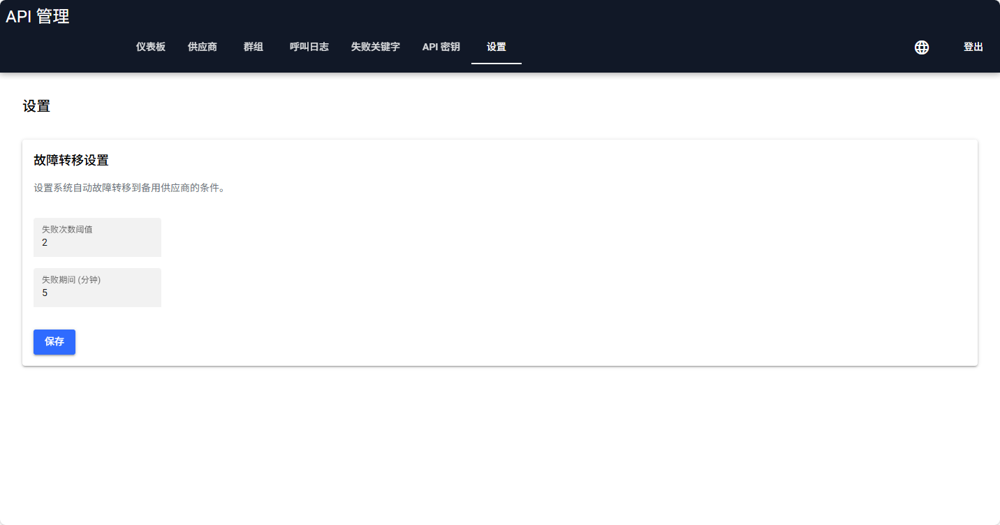
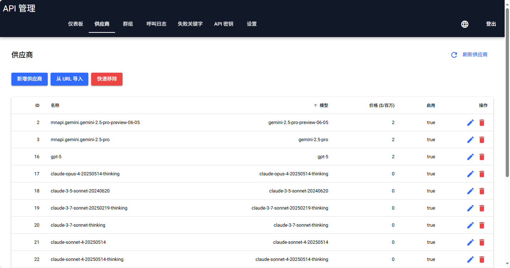
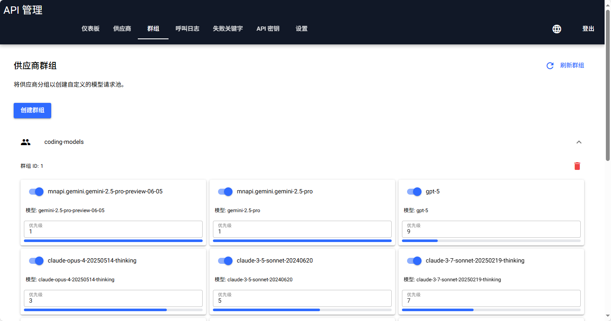
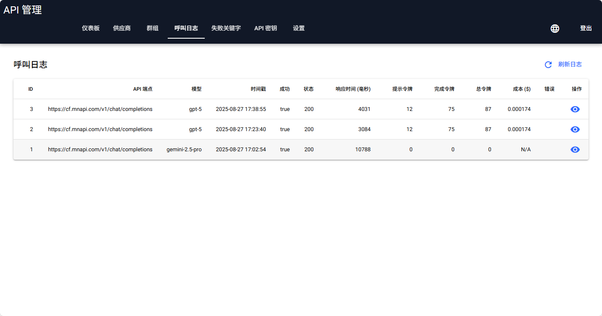
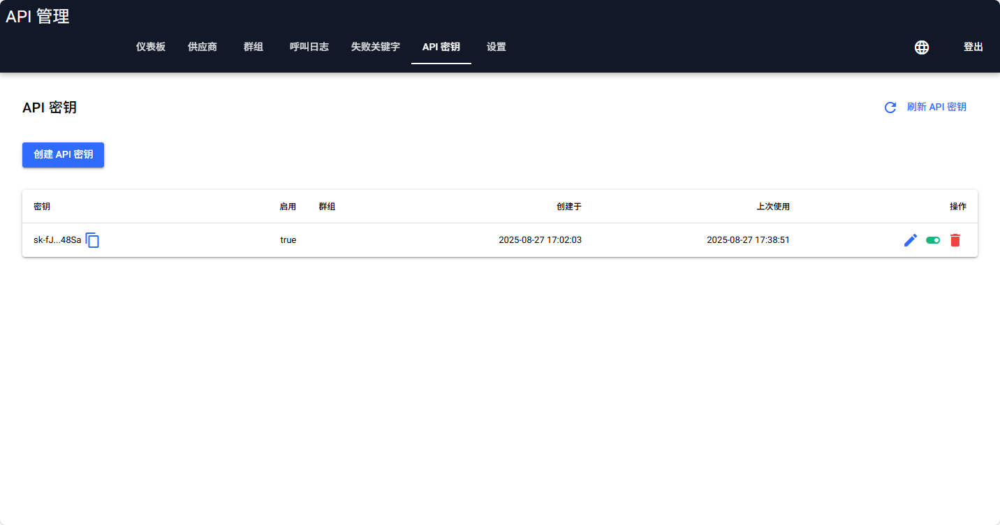
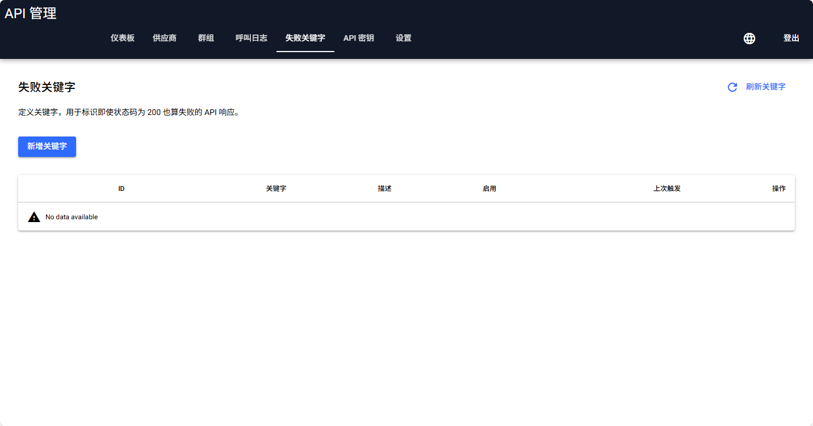
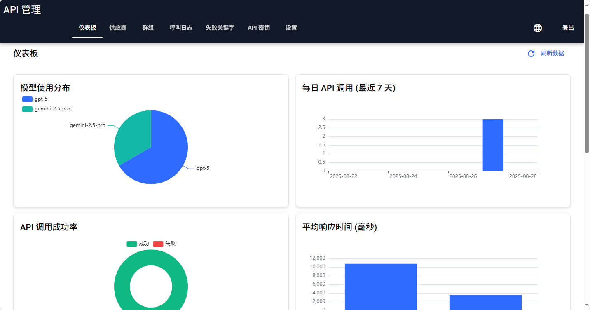

[English](README.md) | [简体中文](README_zh-CN.md) | [繁體中文](README_zh-TW.md) | [한국어](README_KO.md) | [日本語](README_JA.md)

---
# AI Provider API 服务器

一个智能型 API 服务器，用于管理并路由对各种 AI 供应商的请求，其灵感来自于顶尖的开源代理服务器解决方案。此服务器为各种下游 AI 模型和服务提供了一个统一的、与 OpenAI 兼容的 API 端点。其核心优势在于其强大而灵活的 API 路由和筛选功能。

## ✨ 核心功能：智能型 API 路由

此服务器的主要功能是作为您的应用程序与各种 AI 模型供应商之间的智能中介。您可以定义一个供应商端点池并将它们分组，让服务器根据一组规则为每个传入的请求动态选择最佳的一个。

### 运作原理

1.  **供应商 (Providers)**：首先，您需要注册各个 AI 供应商的端点。每个供应商都有自己的 API 密钥、端点 URL 和成本信息（例如，每百万 token 的价格）。

2.  **群组 (Groups)**：接着，您可以创建“群组”并将供应商加入其中。群组作为一个虚拟的、统一的模型端点。例如，您可以创建一个名为 `gpt-4-pool` 的群组，其中包含来自多个供应商、都提供 GPT-4 等级模型的端点。

3.  **基于优先级的路由 (Priority-Based Routing)**：在群组内，您为每个供应商分配一个 `priority`（优先级）数字。当该群组收到请求时，服务器将首先尝试使用具有最低优先级数字（例如，优先级 `1`）的供应商。

4.  **自动故障转移 (Automatic Failover)**：如果最高优先级的供应商失败（例如，由于 API 错误、网络问题或达到速率限制），服务器会自动且无缝地使用优先级列表中的下一个供应商重试该请求。此过程将持续进行，直到请求成功或群组中的所有供应商都已尝试过。

5.  **API 调用**：您的应用程序发出一个标准的、与 OpenAI 兼容的 API 调用，但在 `model` 参数中，您指定的不是像 `gpt-4-turbo` 这样的具体模型名称，而是您设置的**群组名称**（例如 `gpt-4-pool`）。

这种架构提供了高可用性、成本优化（通过优先使用较便宜的供应商），并极大地简化了您客户端的逻辑。

## 💎 更多功能

*   **与 OpenAI 的兼容性**：通过支持 `/v1/chat/completions` 和 `/v1/models` 端点，无缝整合您现有的工具和函数库。
*   **进阶 API 密钥管理**：产生 API 密钥并将其精确地分配给特定群组，以实现对模型存取的精细控制。
*   **模型导入工具**：从任何与 OpenAI 兼容的供应商快速导入模型。支持别名、筛选和关键字过滤，以便于整理。
*   **串流支持**：完全支持串流回应，提供即时的聊天机器人体验。
*   **可设定的故障转移**：通过网页介面微调故障转移逻辑，设定失败重试的阈值和时间范围。

## 🖥️ 可视化管理后台

应用程序包含一个基于 [NiceGUI](https://nicegui.io/) 的现代化、功能丰富的管理后台。

*   **交互式仪表板**：通过多个图表可视化 API 使用情况，包括模型分布、每日流量、成功率和平均响应时间。
*   **多语言支持**：介面支持多种语言，包括英文、中文、日文和韩文。
*   **供应商和群组管理**：在一个直观的介面中新增、编辑和分组您的 AI 模型供应商。
*   **详细的调用日志**：检查每个 API 请求的详细日志，包括 HTTP 状态、响应时间、Token 使用量和成本。
*   **失败关键字**：定义在供应商回应中触发自动重试的关键字。

## 🖼️ 功能展示

| 设置 | 供应商 | 群组 |
| :---: | :---: | :---: |
|  |  |  |
| 设置全局设定，例如 UI 语言和故障转移重试逻辑。 | 管理您所有的 AI 供应商端点，包括凭证、成本和强大的模型导入工具。 | 将多个供应商组合在一起，创建一个具有基于优先级的故障转移功能的虚拟端点。 |

| 调用日志 | API 密钥 | 失败关键字 |
| :---: | :---: | :---: |
|  |  |  |
| 检查每个 API 调用的详细日志。点击日志即可查阅完整的回应内容，以及费用详情。 | 产生 API 密钥并将其分配给特定群组，以进行精细的存取控制。 | 定义在供应商回应中发现时触发自动故障转移的关键字。 |

| 仪表板 |
| :---: |
|  |
| 即时监控 API 使用情况、成功率和效能指标，一目了然。 |

##  快速入门

请按照以下说明在您的本机电脑上启动并执行 API 服务器。

### 先决条件

*   Python 3.8+
*   一个 ASGI 服务器，如 Uvicorn

### 安装步骤

1.  **克隆存储库：**
    ```bash
    git clone https://github.com/felixszeto/NiceAPI.git
    cd NiceAPI
    ```

2.  **创建并启用虚拟环境（建议）：**
    ```bash
    python -m venv venv
    # 在 Windows 上
    venv\Scripts\activate
    # 在 macOS/Linux 上
    source venv/bin/activate
    ```

3.  **安装依赖套件：**
    ```bash
    pip install -r requirements.txt
    ```

4.  **设定您的环境：**
    创建一个名为 `.env` 的文件，并填入以下内容：
    ```env
    # .env

    # The database file will be created in the root directory
    DATABASE_URL="sqlite:///./api_server.db"

    # Admin user credentials for the web UI
    ADMIN_USERNAME="admin"
    ADMIN_PASSWORD="password"
    ```
    应用程序预设使用 SQLite，因此初始设定不需要外部数据库服务器。您可以根据需要修改 `ADMIN_USERNAME` 和 `ADMIN_PASSWORD`。

### 执行应用程序

应用程序将在首次执行时自动创建并初始化数据库。

要启动服务器，只需执行提供的批处理文件：

```bash
start.bat
```

或者，您也可以直接使用 `uvicorn` 执行：

```bash
uvicorn main:app --reload --port 8001 --host 0.0.0.0
```

服务器将在 `http://localhost:8001` 上提供服务。

## 🖥️ 存取网页管理介面

服务器执行后，您可以通过在网页浏览器中导航至 `http://localhost:8001` 来存取管理介面。

**预设登入凭证：**
*   **使用者名称：** `admin`
*   **密码：** `password`

您可以在 `.env` 文件中修改这些凭证。

登入后，您可以：
*   在**仪表板**上监控 API 使用情况。
*   新增、编辑和**导入** AI **供应商**。
*   创建**群组**并为其分配具有特定优先级的供应商。
*   产生和管理 **API 密钥**，并将其指派给群组。
*   查看详细的 API **调用日志**。
*   管理用于自动故障转移的**失败关键字**。
*   调整全局**设定**，例如故障转移逻辑。

## 🤖 API 使用方式

要使用 API，请向 `v1/chat/completions` 端点发送请求。

**重要提示：** 您请求主体中的 `model` 参数应该是您在网页介面中设定的**群组名称**。服务器将根据您的路由规则从该群组中选择一个供应商。

### `curl` 范例

以下是使用 `curl` 发出请求的范例。请将 `YOUR_API_KEY` 替换为有效的密钥，并将 `your-group-name` 替换为您要使用的群组名称。

```bash
curl http://localhost:8001/v1/chat/completions \
  -H "Content-Type: application/json" \
  -H "Authorization: Bearer YOUR_API_KEY" \
  -d '{
    "model": "your-group-name",
    "messages": [
      {
        "role": "user",
        "content": "你好吗？"
      }
    ],
    "stream": false
  }'
```

回应将是来自所选供应商的标准 OpenAI 相容 JSON 对象。

## 📜 授权

本专案采用 MIT 授权 - 详情请参阅 [LICENSE](LICENSE) 文件。